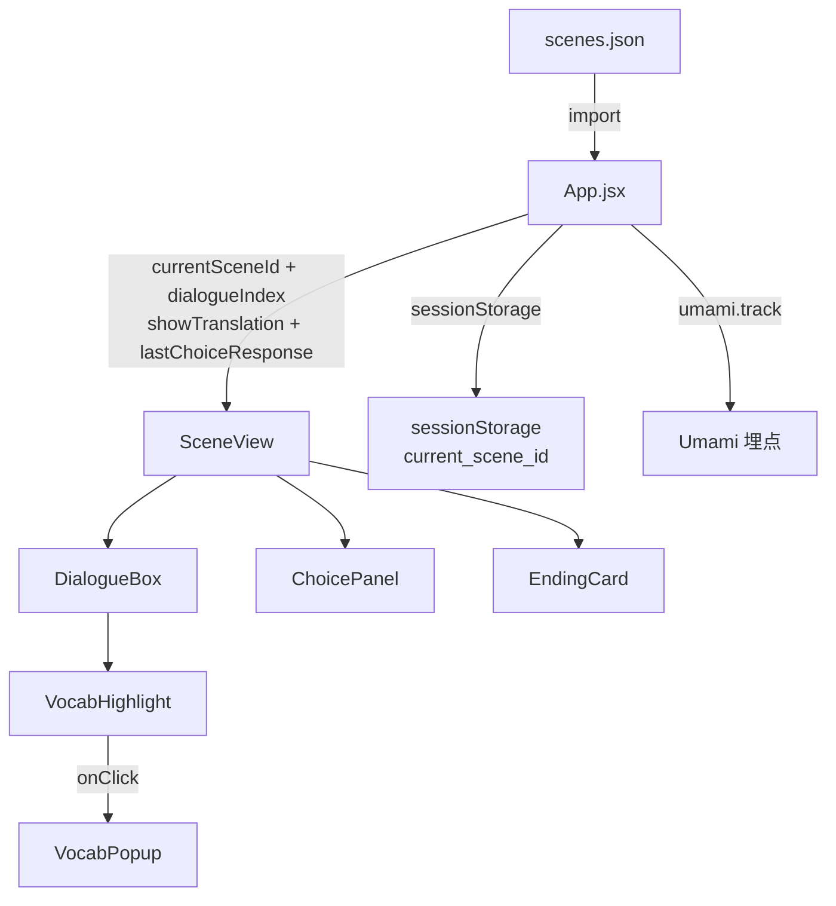

# 技术设计文档

## 概述

本文档描述印尼语沉浸式学习平台 MVP Demo 的技术设计。该应用是一个纯前端 React 应用，采用视觉小说式场景对话形式，数据 hardcode 在本地 `scenes.json` 中，部署至 Vercel。

核心设计原则：
- **零后端依赖**：所有数据本地化，无网络请求
- **最小状态**：仅追踪当前场景 ID 和当前已展示对话数
- **单向数据流**：`scenes.json` → App 状态 → 组件渲染

---

## 架构

### 整体架构图



### 技术栈

| 层次 | 技术 |
|------|------|
| UI 框架 | React 18 |
| 样式 | Tailwind CSS v3 |
| 数据 | 本地 `scenes.json`（静态 import） |
| 状态管理 | React `useState` / `useEffect`（无需外部状态库） |
| 会话持久化 | `sessionStorage` |
| 埋点 | Umami（`<script>` 标签注入） |
| 部署 | Vercel 静态托管 |

---

## 组件与接口

### 组件树

```
App
└── SceneView
    ├── DialogueBox（× N，已展示的对话轮）
    │   └── VocabHighlight
    │       └── VocabPopup（最多 1 个，全局单例）
    ├── ChoicePanel（场景结束且 choices 非空时）
    └── EndingCard（场景 5 结束时）
```

### App.jsx

应用根组件，持有全局状态，负责场景切换、sessionStorage 读写和 Umami 埋点。

**状态：**
```js
const [currentSceneId, setCurrentSceneId] = useState(initialSceneId)
const [dialogueIndex, setDialogueIndex]   = useState(0)
const [showTranslation, setShowTranslation] = useState(false)
const [lastChoiceResponse, setLastChoiceResponse] = useState(null)
// initialSceneId 优先从 sessionStorage 读取，否则取第一个场景
```

**核心逻辑：**
```
初始化：
  sceneId = sessionStorage.getItem('current_scene_id') ?? scenes[0].scene_id
  setCurrentSceneId(sceneId)
  umami.track('enter_scene', { scene_id: sceneId })

切换场景（navigateTo(sceneId, response = null)）：
  setCurrentSceneId(sceneId)
  setDialogueIndex(0)
  setLastChoiceResponse(response)   // null 时清空，有值时存入
  sessionStorage.setItem('current_scene_id', sceneId)
  umami.track('enter_scene', { scene_id: sceneId })
  if sceneId === 'jakarta_chinatown_05' 且 EndingCard 展示后：
    umami.track('complete_chapter_1')

重置（handleRestart）：
  navigateTo('jakarta_nightmarket_01')
```

**Props 传递给 SceneView：**
```ts
{
  scene: SceneData          // 当前场景完整数据
  dialogueIndex: number     // 已展示对话数（0-based，展示 0..dialogueIndex-1）
  onAdvance: () => void     // 推进到下一轮对话
  onNavigate: (id: string, response?: string, isCorrect?: boolean | null) => void  // 跳转到指定场景
  onRestart: () => void     // 重置到第一个场景
  showTranslation: boolean  // 全局中文显示/隐藏开关
  onToggleTranslation: () => void  // 切换中文显示状态
  lastChoiceResponse: { text: string; isCorrect: boolean | null } | null  // 上一个选项的 NPC 回应
}
```

---

### SceneView.jsx

场景主容器，渲染背景、对话列表、底部操作区。

**Props：**
```ts
interface SceneViewProps {
  scene: SceneData
  dialogueIndex: number
  onAdvance: () => void
  onNavigate: (sceneId: string, response?: string, isCorrect?: boolean | null) => void
  onRestart: () => void
  showTranslation: boolean
  onToggleTranslation: () => void
  lastChoiceResponse: { text: string; isCorrect: boolean | null } | null
}
```

**渲染逻辑（伪代码）：**
```
const visibleDialogues = scene.dialogues.slice(0, dialogueIndex)
const isFinished = dialogueIndex >= scene.dialogues.length
const showChoices = isFinished && scene.choices.length > 0
const showEnding  = isFinished && scene.choices.length === 0 && scene.ending != null

return (
  <div style={background: scene.background_style} class="fade-transition">
    {/* 地点标签（可选） */}
    {scene.location_label && <div class="location-label">{scene.location_label}</div>}

    {/* ChoiceResponse 插入对话（在第一轮对话前渲染，渲染后清空） */}
    {lastChoiceResponse && dialogueIndex === 0 &&
      <ChoiceResponseBox response={lastChoiceResponse} />
    }

    {visibleDialogues.map(d => <DialogueBox dialogue={d} showTranslation={showTranslation} />)}

    {!isFinished && <button onClick={onAdvance}>继续</button>}
    {showChoices  && <ChoicePanel choices={scene.choices} onNavigate={onNavigate} />}
    {showEnding   && <EndingCard ending={scene.ending} onRestart={onRestart} />}
  </div>
)
```

> **转场动画**：场景切换时通过 CSS `opacity` transition（0.5 秒）实现淡入淡出效果，可在 SceneView 外层容器上通过 key 变化触发重新挂载，或使用 `useEffect` 控制 opacity 状态。
>
> **ChoiceResponse 渲染时机**：`lastChoiceResponse` 在 `navigateTo` 时写入，SceneView 在 `dialogueIndex === 0` 时（即场景刚进入、尚未推进任何对话）渲染插入对话框；用户点击"继续"推进第一轮对话后，该状态由 App 层清空（或在 SceneView 内部通过 `useEffect` 监听 `dialogueIndex > 0` 时通知父组件清空）。

---

### DialogueBox.jsx

渲染单轮对话：角色名 + 印尼语文本（含高亮词）+ 中文对照。

**Props：**
```ts
interface DialogueBoxProps {
  dialogue: DialogueData   // { character, indo, zh, vocab_hints }
  onWordClick: (hint: VocabHint) => void  // 点击高亮词回调（冒泡至 App）
  showTranslation: boolean  // 全局中文显示/隐藏开关
}
```

**渲染结构：**
```
<div class="dialogue-box">
  <span class="character-name">{dialogue.character}</span>
  <VocabHighlight
    text={dialogue.indo}
    hints={dialogue.vocab_hints}
    onWordClick={onWordClick}
  />
  {/* 中文对照：showTranslation 为 false 时 blur-sm 样式，点击单条揭示 */}
  <p
    class={showTranslation || revealed ? "zh-translation" : "zh-translation blur-sm cursor-pointer"}
    onClick={() => setRevealed(true)}
  >
    {dialogue.zh}
  </p>
</div>
```

> **单条揭示**：每个 DialogueBox 维护自身的 `revealed` 本地状态（默认 `false`）。当全局 `showTranslation` 为 `true` 时，所有对话框中文直接显示；当 `showTranslation` 为 `false` 时，用户可点击单条对话框的模糊区域揭示该条中文（`revealed = true`），不影响其他对话框。

---

### VocabHighlight.jsx

将印尼语文本按 `vocab_hints` 中的词语拆分为普通文本段和高亮词段。

**Props：**
```ts
interface VocabHighlightProps {
  text: string              // 印尼语原文
  hints: VocabHint[]        // 生词提示数组
  onWordClick: (hint: VocabHint) => void
}
```

**核心算法（伪代码）：**
```
function splitTextWithHighlights(text, hints):
  // 1. 构建词语位置映射（大小写不敏感）
  segments = []
  remaining = text
  cursor = 0

  // 2. 找出所有 hint.word 在 text 中的出现位置（不区分大小写）
  matches = []
  for hint in hints:
    regex = new RegExp(escapeRegex(hint.word), 'gi')
    for match in regex.exec(text):
      matches.push({ start: match.index, end: match.index + match[0].length, hint })

  // 3. 按 start 排序，去除重叠
  matches.sort(by start)

  // 4. 生成 segments 数组
  for match in matches:
    if match.start > cursor:
      segments.push({ type: 'text', content: text.slice(cursor, match.start) })
    segments.push({ type: 'highlight', content: text.slice(match.start, match.end), hint: match.hint })
    cursor = match.end
  if cursor < text.length:
    segments.push({ type: 'text', content: text.slice(cursor) })

  return segments

// 渲染
return (
  <span>
    {segments.map(seg =>
      seg.type === 'highlight'
        ? <span class="highlight" onClick={() => onWordClick(seg.hint)}>{seg.content}</span>
        : <span>{seg.content}</span>
    )}
  </span>
)
```

---

### VocabPopup.jsx

生词弹窗，展示词义、词根拆解和文化钩子。由 App 层统一管理开关状态（单例）。

**Props：**
```ts
interface VocabPopupProps {
  hint: VocabHint | null    // null 时不渲染
  onClose: () => void
}
```

**渲染结构：**
```
// hint 为 null 时返回 null
<div class="popup-overlay" onClick={onClose}>
  <div class="popup-card" onClick={e => e.stopPropagation()}>
    <button class="close-btn" onClick={onClose}>×</button>
    <h3>{hint.word}</h3>
    <p><b>词义：</b>{hint.meaning}</p>
    <p><b>词根：</b>{hint.root}</p>
    <p><b>文化：</b>{hint.culture_hook}</p>
  </div>
</div>
```

**单例管理（在 App.jsx 中）：**
```js
const [activeHint, setActiveHint] = useState(null)
// 传递给所有 DialogueBox 的 onWordClick
const handleWordClick = (hint) => setActiveHint(hint)
const handlePopupClose = () => setActiveHint(null)
```

---

### ChoicePanel.jsx

展示场景结束后的跳转选项。

**Props：**
```ts
interface ChoicePanelProps {
  choices: Choice[]
  onNavigate: (sceneId: string, response?: string, isCorrect?: boolean | null) => void
}
```

**渲染结构：**
```
<div class="choice-panel">
  {choices.map(c =>
    <button onClick={() => onNavigate(c.next, c.response, c.type === 'challenge' ? c.correct : null)}>
      {c.label}
    </button>
  )}
</div>
```

> `challenge` 类型选项可选择性地添加视觉区分（如边框颜色），但不强制要求，不影响沉浸感。

---

### EndingCard.jsx

第一章结尾专属组件，展示悬念钩子。

**Props：**
```ts
interface EndingCardProps {
  ending: EndingData   // { title, text, cta_text }
  onRestart: () => void
}
```

**渲染结构：**
```
<div class="ending-card">
  <h2>{ending.title}</h2>
  <p>{ending.text}</p>
  <button onClick={onRestart}>{ending.cta_text}</button>
</div>
```

---

## 数据模型

### scenes.json 结构

```ts
// 顶层：场景数组
type ScenesData = SceneData[]

interface SceneData {
  scene_id: string           // e.g. "jakarta_nightmarket_01"
  chapter: number            // 1
  background_style: string   // CSS 渐变字符串，e.g. "linear-gradient(135deg, #1a1a2e, #16213e)"
  location_label?: string    // 可选，场景地点标签，e.g. "🌙 华人区夜市 · 夜晚"
  dialogues: DialogueData[]  // 5-8 条
  choices: Choice[]          // 普通场景 2-3 条；场景 5 为空数组 []
  ending?: EndingData        // 仅场景 5 存在
}

interface DialogueData {
  character: string          // 角色名，e.g. "小明" / "摊主"
  indo: string               // 印尼语原文
  zh: string                 // 中文对照
  vocab_hints: VocabHint[]   // 零个或多个生词提示
}

interface VocabHint {
  word: string               // 高亮词（与 indo 中的词语对应）
  meaning: string            // 词义
  root: string               // 词根拆解
  culture_hook: string       // 文化钩子
}

interface Choice {
  label: string              // 按钮文本，格式："印尼语（中文注释）"
  next: string               // 目标 scene_id
  type?: "story" | "challenge"  // 可选，缺省为 "story"
  correct?: boolean          // 可选，仅 challenge 类型使用
  response?: string          // 可选，选择后 NPC 的回应文本（含中文注释）
}

interface EndingData {
  title: string              // 结尾标题
  text: string               // 正文
  cta_text: string           // 行动号召按钮文字
}
```

### 应用状态模型

```ts
// App 级别状态（全部用 useState 管理）
interface AppState {
  currentSceneId: string     // 当前场景 ID
  dialogueIndex: number      // 已展示对话数（0 = 未展示任何对话）
  activeHint: VocabHint | null  // 当前打开的生词弹窗数据
  showTranslation: boolean   // 全局中文显示/隐藏开关（默认 false）
  lastChoiceResponse: {      // 上一个选项的 NPC 回应（null 表示无回应）
    text: string
    isCorrect: boolean | null  // null 表示 story 类型（无对错）
  } | null
}
```

### sessionStorage 键值

| 键 | 值类型 | 说明 |
|----|--------|------|
| `current_scene_id` | string | 当前场景 ID，页面关闭后自动清除 |

---

## 正确性属性

*属性（Property）是在系统所有有效执行中都应成立的特征或行为——本质上是对系统应做什么的形式化陈述。属性是人类可读规范与机器可验证正确性保证之间的桥梁。*

### 属性 1：对话推进单调递增

*对于任意场景（包含 5-8 轮对话）和任意有效的初始对话索引（0 ≤ index < dialogues.length），每次调用 `onAdvance` 后，`dialogueIndex` 恰好增加 1，且渲染的 DialogueBox 数量等于新的 `dialogueIndex`。*

**验证需求：2.1、2.2、2.3**

### 属性 2：高亮词拆分覆盖完整性

*对于任意印尼语文本字符串和任意 `vocab_hints` 数组（包括空数组），`splitTextWithHighlights` 函数输出的所有 segment 的 `content` 字段拼接后，应与原始文本字符串完全相等（字符级别，无遗漏、无重复）。*

**验证需求：3.1、3.4、3.5**

### 属性 3：高亮词大小写不敏感匹配

*对于任意 `vocab_hints` 中的词语 W 和任意包含 W 的文本（W 以任意大小写形式出现），`splitTextWithHighlights` 的输出中应存在至少一个 `type === 'highlight'` 的 segment，其 `content` 与文本中出现的形式相同。*

**验证需求：3.2**

### 属性 4：生词弹窗单例不变量

*对于任意两个不同的 VocabHint，依次点击对应的高亮词后，`activeHint` 应等于最后点击的那个 VocabHint，而非两者同时存在；在任意时刻，`activeHint` 只能是 `null` 或单个 VocabHint 对象。*

**验证需求：4.4**

### 属性 5：场景切换重置对话索引

*对于任意目标场景 ID（包括当前场景 ID），调用 `navigateTo(sceneId)` 后，`currentSceneId` 等于目标 ID 且 `dialogueIndex` 等于 0，与调用前的任意状态无关。*

**验证需求：5.2**

### 属性 6：sessionStorage 与当前场景一致性

*对于任意场景切换操作序列，每次 `navigateTo` 调用后，`sessionStorage.getItem('current_scene_id')` 的值始终与 `currentSceneId` 状态保持严格一致。*

**验证需求：9.4**

### 属性 7：场景结束状态互斥

*对于任意场景数据，当 `dialogueIndex >= scene.dialogues.length` 时：若 `choices.length > 0`，则渲染 ChoicePanel 且不渲染 EndingCard 和继续按钮；若 `choices.length === 0`，则渲染 EndingCard 且不渲染 ChoicePanel 和继续按钮。两种面板不能同时出现，继续按钮不能与任一面板同时出现。*

**验证需求：2.4、5.4、5.5、6.1、6.5**

---

## 错误处理

### 场景数据校验

在 App 初始化时对 `scenes.json` 进行校验：

```js
function validateScene(scene) {
  const required = ['scene_id', 'chapter', 'background_style', 'dialogues']
  for (const field of required) {
    if (scene[field] == null) {
      console.error(`[Scene Error] 场景 ${scene.scene_id ?? '未知'} 缺少必填字段: ${field}`)
      return false
    }
  }
  return true
}

// 过滤无效场景，仅渲染通过校验的场景
const validScenes = scenesData.filter(validateScene)
```

### Umami 埋点容错

```js
function trackEvent(name, props) {
  try {
    if (typeof window.umami !== 'undefined') {
      window.umami.track(name, props)
    }
  } catch (e) {
    // 静默失败，不影响用户体验
    console.warn('[Umami] 埋点上报失败:', e)
  }
}
```

### sessionStorage 容错

```js
function getInitialSceneId(scenes) {
  try {
    const saved = sessionStorage.getItem('current_scene_id')
    if (saved && scenes.find(s => s.scene_id === saved)) {
      return saved
    }
  } catch (e) {
    // sessionStorage 不可用（如隐私模式限制）时静默降级
  }
  return scenes[0].scene_id
}
```

---

## 测试策略

### 单元测试

重点覆盖纯函数逻辑：

| 测试目标 | 测试类型 | 说明 |
|----------|----------|------|
| `splitTextWithHighlights` | 属性测试 + 单元测试 | 覆盖空 hints、多词重叠、大小写变体 |
| `validateScene` | 单元测试 | 覆盖各必填字段缺失场景 |
| `getInitialSceneId` | 单元测试 | 覆盖 sessionStorage 有值/无值/无效值 |
| 场景结束状态判断逻辑 | 属性测试 | 验证 ChoicePanel/EndingCard 互斥 |

### 属性测试配置

使用 **fast-check**（TypeScript/JavaScript 属性测试库）：

```js
// 示例：属性 2 - 高亮词拆分覆盖完整性
import fc from 'fast-check'
import { splitTextWithHighlights } from './VocabHighlight'

test('Property 2: 拆分结果拼接等于原文', () => {
  // Feature: indonesian-learning-mvp, Property 2: 高亮词拆分覆盖完整性
  fc.assert(
    fc.property(
      fc.string(),                    // 任意印尼语文本
      fc.array(fc.record({            // 任意 vocab_hints
        word: fc.string({ minLength: 1 }),
        meaning: fc.string(),
        root: fc.string(),
        culture_hook: fc.string(),
      })),
      (text, hints) => {
        const segments = splitTextWithHighlights(text, hints)
        const reconstructed = segments.map(s => s.content).join('')
        return reconstructed === text
      }
    ),
    { numRuns: 100 }
  )
})
```

每个属性测试最少运行 **100 次**迭代。

### 集成测试

使用 React Testing Library 覆盖关键用户流程：

1. 进入应用 → 看到第一轮对话
2. 点击"继续" × N → 看到 ChoicePanel
3. 点击选项 → 切换到下一场景，对话重置
4. 完成场景 5 → 看到 EndingCard
5. 点击 EndingCard CTA → 重置到场景 1

### 手动测试检查清单

- [ ] 移动端（375px）布局可读可交互
- [ ] 桌面端（1024px）布局可读可交互
- [ ] 高亮词点击弹窗正常展示
- [ ] 弹窗点击外部/关闭按钮正常关闭
- [ ] 刷新页面后从 sessionStorage 恢复场景
- [ ] 关闭标签页后重新打开从场景 1 开始
- [ ] Umami 控制台无报错（网络正常时）
- [ ] Umami 加载失败时应用正常运行
